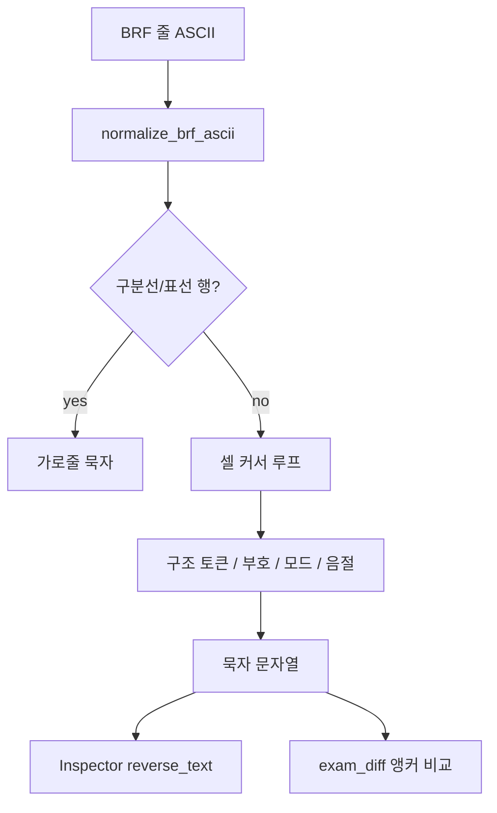

# 역점역 (BRF ASCII → 묵자)

역점역은 **생성·참고 BRF를 사람이 읽고, 내용 비교·Inspector에서 진단**하기 위한 보조 경로다.  
제품의 최종 정합 척도는 [architecture.md](architecture.md)·[quality_loop.md](quality_loop.md)에 적힌 대로 **ASCII 셀 줄 비교**이며, 역점역 유사도만으로 점역 버그를 단정하지 않는다.

---

## 1. 모듈 구조

```text
brf/
  ascii_braille.py      Braille ASCII ↔ 유니코드 점자, ` → @ 정규화
  korean_tables.py      초·중·종, 약자/약어, 온표 본문, 문장부호 표
  reverse_translator.py 행 단위 상태 기계 역점역 (진입점)
  parser.py             BRF 파싱 시 line.reverse_text 채움
  exam_diff.py          역점역 묵자로 지문/문항 앵커 내용 비교
  structure_detect.py   행 후보 태그 (역점역과 독립, 구조 휴리스틱)

braille/
  translator.py         정방향(묵자→ASCII). 표·특수 형태를 korean_tables와 공유
```

| 기호 | 설명 |
|------|------|
| 진입점 | `reverse_translate_line(raw_ascii: str) -> str` |
| 호출 | `parser` (행마다), `exam_diff` (내용 비교), BRF Inspector UI |
| 표 소스 | `korean_tables` — 정방향과 동일 셀 정의 |

정방향 인코딩은 `braille/translator.hangul_text_to_ascii` / `TableBrailleTranslator`이며, 역점역과 **같은 표를 쓰되 알고리즘은 대칭이 아니다** (약자·온표·수표는 문맥 의존).

---

## 2. 데이터 흐름



1. `normalize_brf_ascii`: 백틱 `` ` `` → `@` 등 ASCII 정규화.
2. 행 전체가 구분선·표선이면 음절 해독 없이 `────────────────`으로 치환.
3. 그 외에는 커서 `i`로 셀을 소비하며 최장 일치·상태(따옴표 깊이, 드러냄표, 로마자 모드)를 갱신.
4. 미인식 셀은 `<U:…>`로 남긴다 (침묵 폴백 없음).

---

## 3. `reverse_translate_line` 처리 순서

대략적인 우선순위 (앞이 이김):

1. **행 단위** — `_is_separator_line` (예: `=ggg…=`, `=777…=`, `!333…4`류 표선)
2. **지문/숫자 범위** — `82#…@9#…;0` → `[1~3]`, `#aj@9#ae` → `10~15`
3. **원문자 선택지** — `7#a7`…`7#e7` 또는 `#1`…`#5` → ①…⑤
4. **선택지 항목 표지** — `_0` (⠇⠴) 생략, 번호 뒤 공백 보정
5. **장식 반복** — 동일 셀 6칸 이상 (`g`/`3`/`7`/`=`/`*`) 스킵
6. **복합 문장부호** — `PUNCT_MULTI` 최장 일치 (`82`는 지문범위가 아닐 때만 `[`)
7. **온표** — `=` + 자모 본문 (`ON_SIGN_BODIES`, 종성·초성 별칭)
8. **드러냄표** — `7` … `7` → `‘` … `’` (열린 동안 종성 `7` 금지)
9. **수표** — `#` + `a`–`j`
10. **로마자 모드** — `0` + `,`/글자; 레거시 `; ,X`  
    (로마자표 없는 `z` 등은 한글 약자. 원문 Latin은 정방향이 `0z`로 넣음)
11. **단어 약어·것** — `au`, `_s` 등
12. **된소리·초성·가류 약자·VC 약자·중성** — 음절 조립  
    - 특수: `j:/` → `하였` (하+였); `.:/` → `졌` (자+였 아님)
13. **1칸 구두점** — `PUNCT_SINGLE` (`3`→`:`, `1`→`,` 등)
14. **기타** — `<U:cell>`

---

## 4. `korean_tables`에서 역점역이 쓰는 것

| 상수/표 | 용도 |
|---------|------|
| `CHOSEONG` / `JUNGSEONG` / `JONGSEONG` (+ digraph) | 음절 분해·조립 |
| `ABBREV_CV` / `ABBREV_VC` / `WORD_ABBREV` / `ABBREV_GEOT` | 약자·약어 |
| `TENSED_PREFIX` / `TENSED_MAP` | 된소리 |
| `ON_SIGN` / `ON_SIGN_BODIES` | 단독 자모 (온표+종성 관례, 초성 별칭 포함) |
| `PUNCT_MULTI` / `PUNCT_SINGLE` | 따옴표·괄호·`@9`(~)·`11`(:) 등 |
| `NUMBER_SIGN` / `NUMBER_MAP` / `ROMAN_SIGN` / `LETTER_SIGN` | 수·영문 |
| `YEONG_ONSET_OVERRIDE` | 성/정/청 |
| `compose_hangul` | 묵자 음절 생성 |

정방향 전용에 가까운 것: `JAMO_COMPAT_TO_ASCII` (인코딩), translator의 `_PUNCT_TO_ASCII`. 역점역 본문 매핑은 `PUNCT_MULTI`·`ON_SIGN_BODIES` 쪽이 권위다.

---

## 5. 시험지 구조 토큰 (유지하는 관례)

한국 수능·모의고사 점자 관례로 취급하며, **단일 PDF 과적합 후처리가 아니다**.

| 점자(ASCII) | 묵자 | 비고 |
|-------------|------|------|
| `7#a7`… / `#1`…`#5` | ①…⑤ | 정방향·참고 BRF 이중 관례 |
| `_0` | (생략) | 선택지 본문 시작 표지 |
| `@9` | ~ | 숫자·문자 범위 |
| `82`…`;0` | [ ] | `#…@9#…`면 지문범위 우선 |
| `=g…g=` / `=7…7=` / 표선 | ──── | 행 단위 |
| `7`…`7` | ‘…’ | 드러냄표 |
| `3` / `11` | : | 쌍점 |

---

## 6. 의도적으로 두지 않는 것

정리 과정에서 제거했거나 넣지 않는 패턴:

- 묵자 문자열 정규식 후처리 (예: `,‘보기’,` → `<보기>`, `<U:>`+`(훈-음)` → `<한자>`)
- 미해석 셀을 그대로 ASCII로 흘리는 폴백
- 한자·보기 상자의 “모드” — 향후 **행/블록 분류**로 다루는 편이 맞음
- 한자 전환 표(`⠴`/`0` 전치) — 현행 규정에 일반 한자용 전환 표가 없음.
  정방향은 `common/hanja_reading.py`에서 **단독→음독, 병기→한자 생략**만 수행.

새로운 규칙을 넣을 때는 셀 문법·상태 기계에 넣고, 출력 문자열 치환으로 때우지 않는다.

---

## 7. 테스트 위치

| 파일 | 초점 |
|------|------|
| `tests/brf/test_korean_reverse.py` | 기본 음절·헤더 스모크·구분선 |
| `tests/brf/test_reverse_punctuation.py` | 따옴표·온표·지문범위 |
| `tests/brf/test_reverse_brackets.py` | 대괄호·원문자·강조 |
| `tests/brf/test_reverse_roman_tense.py` | 로마자·된소리 |
| `tests/brf/test_reverse_past_rare.py` | 하였/졌·귿/옷 |
| `tests/brf/test_reverse_jong_comma.py` | 종성·인라인 범위 |
| `tests/brf/test_reverse_exam_structure.py` | 보기·[N점]·쌍점·표선·`a~e` |
| `tests/braille/test_jamo_symbols.py` | 호환 자모 온표 라운드트립 |
| `tests/braille/test_translator.py` | 정·역 스모크 |

---

## 8. 관련 문서

- [architecture.md](architecture.md) §4.3–4.5 — 파이프라인 속 위치
- [quality_loop.md](quality_loop.md) — 비교 루프에서 역점역의 역할
- [question_choice_rules.md](question_choice_rules.md) · [separator_patterns.md](separator_patterns.md) — Phase 0 관례 축적
